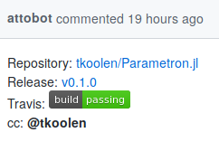
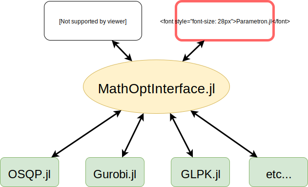
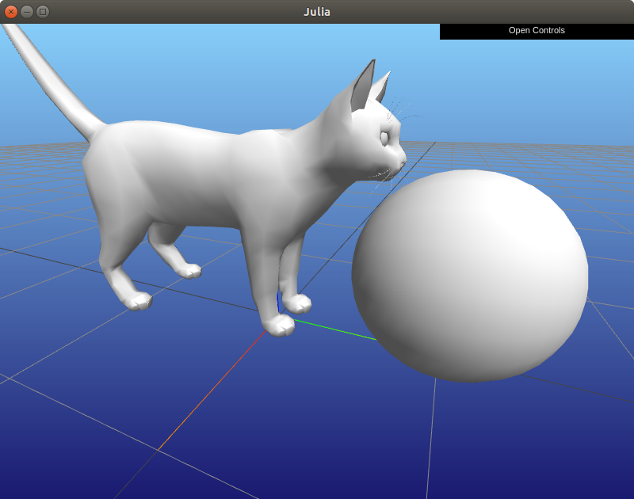
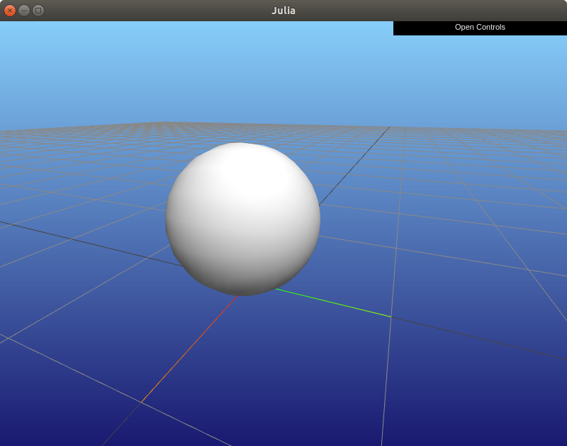
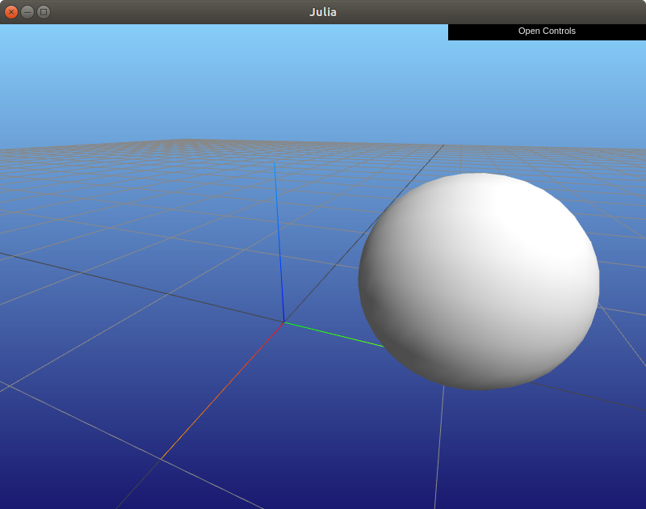
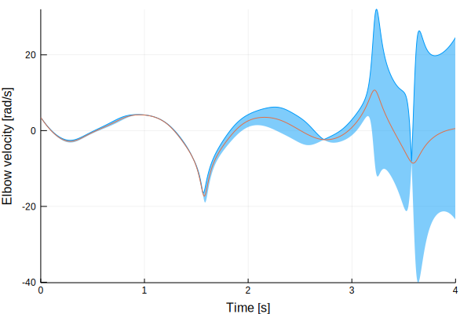
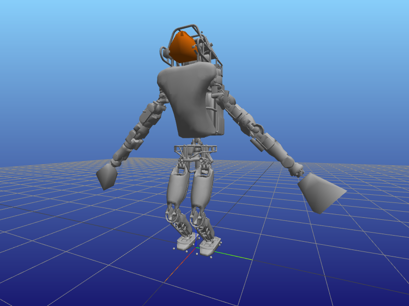
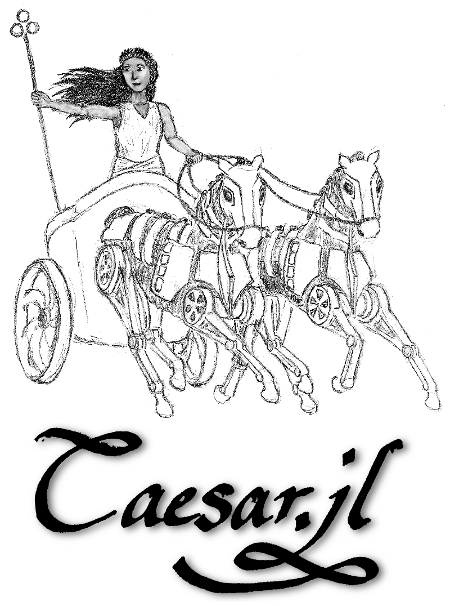
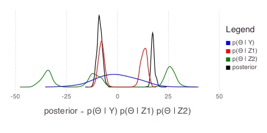

<style type="text/css">
.reveal ul {
    font-size: smaller;
}

.reveal img.noborder {
    border: none;
    background: inherit;
    box-shadow: none;
}

.reveal pre code {
    max-height: 600px;
}
</style>

### Making Robots Walk with Julia


Robin Deits

<div style="font-size: smaller;">
MIT CSAIL: Robot Locomotion Group<br>
JuliaRobotics <br>
August 10, 2018
</div>

---

### Background


* Worked on control of humanoid robots like Atlas (above) since the DARPA Robotics Challenge in 2012
* Started using Julia after taking Alan Edelman's class at MIT

----

### Background: JuliaRobotics


* Home: http://www.juliarobotics.org/
* People:
    * [@affie](https://github.com/Affie) (Johannes Terblanche)
    * [@dehann](https://github.com/dehann) (Dehann Fourie)
    * [@pvazteixeira](https://github.com/pvazteixeira) (Pedro Vaz Teixeira)
    * [@rdeits](https://github.com/rdeits) (Robin Deits)
    * [@tkoolen](https://github.com/tkoolen) (Twan Koolen)
    * [@GearsAD](https://github.com/GearsAD)
    * You?

----

### Robotics

* Robotics is a big field
    * Hardware
    * Software
        * Perception
        * Planning
        * Controls
* Each of these elements has a variety of possible approaches:
    * Explicit algorithms
    * Optimization
    * Machine learning
* And different robots require different approaches:
    * Walking robots
    * Fixed robot arms
    * Flying robots

----

### Robotics

* Robotics is a big field
    * Hardware
    * Software
        * Perception
        * Planning
        * **Controls** &larr;
* Each of these elements has a variety of possible approaches:
    * Explicit algorithms
    * **Optimization** &larr;
    * Machine learning
* And different robots require different approaches:
    * **Walking robots** &larr;
    * Fixed robot arms
    * Flying robots

----

### Optimization-Based Control, Briefly

* All successful walking robots (that I know of) have essentially the same algorithm at their core:
    * Given the current state...
    * Choose an action that minimizes some cost...
    * While respecting the constraints imposed by physics and any tasks your robot must accomplish
* At the lowest level, the state is just the position and velocity of the robot and all its joints, and the action is the command sent to each of those joints.

----

### Optimization-Based Control, Briefly

In a (slightly) more mathematical notation:

\begin{align}
\underset{\text{action}}{\text{minimize}} \quad & \text{cost}\left(\text{state}, \text{action}\right) \\\\
\text{subject to} \quad & \text{physics_constraints}\left(\text{state}, \text{action}\right) \\\\
& \text{task_constraints}\left(\text{state}, \text{action}\right)
\end{align}

* Typical control frequencies for a humanoid robot are 500-1000 Hz
* That means we have to set up and solve the above optimization in about 1 millisecond.

----

### Controls in Julia

* The 1 millisecond requirement has typically meant only C or C++ (or occasionally Java) controllers can actually be used
* Today I'll show off the tools we've built to make this possible in Julia
    * RigidBodyDynamics.jl
    * Parametron.jl
    * MeshCat.jl
    * RigidBodySim.jl
    * QPControl.jl
    * And a few more...

---

### Useful Tools We've Built

<br><br>
<div style="font-size: smaller">
(&gt; 1500 commits across 15 repositories since JuliaCon 2017.)
</div>

---

### RigidBodyDynamics.jl: Fast Dynamics in Pure Julia

<br>


----

### RigidBodyDynamics.jl: Fast Dynamics in Pure Julia

* RigidBodyDynamics.jl is a core library for the lowest-level tasks of controlling a robot, including:
    * Kinematics (How are the parts of the robot connected and how do they move in space?)
    * Dynamics (How will the robot's state change over time given its masses, structure, actions, and external forces?)
    * Contact (How does the robot interact with the world?)
* To learn more about RigidBodyDynamics, check out our previous tutorials:
    * <http://www.juliarobotics.org/tutorials/>

----

### RigidBodyDynamics.jl performance improvements

| Algorithm                | JuliaCon 2017  | JuliaCon 2018  |
| -------------            | :------------- | :------------- |
| Mass matrix              | 26.69 μs       | 6.88 μs        |
| Inverse dynamics         | 25.21 μs       | 8.885 μs       |
| Forward dynamics         | 60.75 μs       | 31.68 μs       |
| Momentum matrix          | 18.22 μs       | 5.32 μs        |
| Jacobian (hand to foot)  | 6.58 μs        | 3.45 μs        |

----

### RigidBodyDynamics.jl performance improvements

* Robot: Atlas (73 state variables), `Float64`
* CPU: i7-6950X (Broadwell, 3.5 GHz)
* 2017: RigidBodyDynamics 0.3.0, Julia 0.6-rc3
* 2018: RigidBodyDynamics 0.9.0, Julia 0.7-rc2

Julia 0.7 ~20% faster than 0.6 accross the board for RBD benchmarks.

Now competitive with fastest C++ implementations for some algorithms.

----

### You Should Try RigidBodyDynamics.jl If:

* You want to model the motion of a rigid mechanism like a robot in 3D space
* You want a dynamics package that makes it easy to do:
    * Differentiation with ForwardDiff.jl
    * Symbolic computations with SymPy.jl
    * Uncertainty propagation with Measurements.jl

---

### Parametron.jl: Fast, Parameterized Optimizations

<br>


----

### Parametron.jl: Fast, Parameterized Optimizations

* We initially used JuMP.jl to set up optimization problems
* But our use cases are a bit different from the typical JuMP model:
    * We care a lot about even very small amounts of overhead (even 1 millisecond spent setting up the model could break our controller)
* We also tend to solve optimizations with the *same structure* every time:
    * The number of variables and constraints don't change
    * The pattern of which constraints depend on which variables doesn't change
    * Only the coefficients of those constraints change as the robot's state changes.

----

### Parametron.jl

* We want to do two things:
    * Describe the structure of the optimization problem (once)
    * Update the values of the parameters based on the robot's current state and solve the optimization (at 500-1000 Hz)
* Instead of using JuMP, we developed Parametron.jl, a new front-end for optimization.

----

### Parametron.jl and JuliaOpt



----

### Parametron.jl Demo

```julia
using Parametron
using OSQP.MathOptInterfaceOSQP

model = Model(OSQPOptimizer())

# A symbolic optimization variable
x = Variable(model)

# A parameter, whose value will update before each solve
p = Parameter(model) do
    rand()  # This is the update function for our parameter
end

# Constraints can refer to variables and parameters
@constraint model p * x <= 1.0

# So can objectives
@objective model Minimize x^2 - p

solve!(model)  # update parameters and call the solver
value(model, x) # get the value of the variable x
```

----

### Parametron.jl Performance

* The `solve!()` function does the following:
    * Update the values of all the `Parameter`s
    * Pass the updated optimization problem to the solver
    * Call the solver itself
    * Retrieve the solution

```julia
julia> using BenchmarkTools

julia> @btime solve!($model) # for the simple model defined above
  4.377 μs (0 allocations: 0 bytes)
```

----

### Parametron.jl Tricks

* Parametron.jl works by converting your parameters and expressions into closures
* Each closure captures the current value and whatever function is needed to update that value

```julia
# Given a Parameter A (a matrix of floats), and
# a vector of variables x
expr = @expression A * x
# `expr` will hold a pre-allocated result, `y`
# and a function to update that result in-place
# any time the parameter `A` changes, as if we
# had written:
#
# y = A * x
# return (y, () -> mul!(y, A, x))
```

* Various specializations allow matrix and vector operations to be done in-place using only pre-allocated memory

----

### You Should Try Parametron.jl If:

* You want to squeeze every last bit of performance out of your optimization framework
* You solve lots of similar optimizations over and over

---

### MeshCat.jl: 3D Visualization



----

### MeshCat.jl: 3D Visualization

* Most of the visualization we do consists of:
    * Loading some geometries (like the links of a robot)
    * Moving those geometries around to animate the robot's motion
* MeshCat.jl is designed to make that as easy as possible, using:
    * Geometries from GeometryTypes.jl
    * Transforms from CoordinateTransformations.jl
    * 3D rendering from three.js (in the browser)
    * Communication from WebIO.jl
* Using three.js means that MeshCat can render 3D scenes...
    * ...in a browser
    * ...in a standalone window (via Blink.jl)
    * ...in a Jupyter notebook cell
    * ...without requiring any binary packages like VTK or GTK

----

### MeshCat.jl Demo

Creating a scene is as easy as:

```julia
using MeshCat, GeometryTypes

vis = Visualizer()
open(vis)  # open the visualizer in a new browser tab
setobject!(vis, Sphere(Point(0, 0, 0.25), 0.25))  # create a sphere
```



----

### MeshCat.jl Demo

You can move objects around with the `settransform!` function:

```julia
using CoordinateTransformations
settransform!(vis, Translation(0, 0, -0.25))
```



----

### MeshCat.jl Demo

Meshes just work, courtesy of MeshIO.jl and FileIO.jl:

```julia
using FileIO, MeshIO
setobject!(vis[:cat],
    load(Pkg.dir("GeometryTypes", "test", "data", "cat.obj")))

settransform!(vis[:cat],
    Translation(0, -1.1, 0) ∘ LinearMap(RotZYX(π, 0, π/2)))
```


----

### MeshCat.jl Animations

```julia
anim = Animation(30)
atframe(anim, vis, 0) do frame
    settransform!(frame, LinearMap(RotZ(-π/4)))
end
atframe(anim, vis, 30) do frame
    settransform!(frame, LinearMap(RotZ(-3π/4)))
end
setanimation!(vis, anim)
```

<video data-autoplay src="assets/img/meshcat-scene.m4v" height="300" controls loop />
</video>

----

### You Should Try MeshCat.jl If:

* You want to visualize a tree of objects in 3D and move those objects around in space
* You want a 3D visualizer that works in Jupyter and doesn't require any compiled binaries (other than the browser you already have)

---

### RigidBodySim.jl: Integrating robot dynamics with JuliaDiffEq



<div style="font-size: 12pt">
    Source: <a href="https://github.com/JuliaRobotics/RigidBodySim.jl/blob/master/notebooks/Uncertainty%20propagation%20using%20Measurements.jl.ipynb">https://github.com/JuliaRobotics/RigidBodySim.jl/blob/master/notebooks/Uncertainty%20propagation%20using%20Measurements.jl.ipynb</a>
</div>


----

### RigidBodySim.jl: Integrating robot dynamics with JuliaDiffEq

* The dynamics of a robot are a function mapping the current state to the rate of change of that state:

$$
\dot{x} = f(x)
$$

* This is simply an Ordinary Differential Equation (ODE)
* Simulating a robot just means integrating that ODE forward in time from some initial state $x_0$
* RigidBodyDynamics.jl can provide that function $f$ for a given robot and controller, so we just need...some sort of differential equations tool in Julia

----

### RigidBodySim.jl

* RigidBodySim.jl provides some helper functions to bridge robot dynamics with the existing suite of diff. eq. tools:
    * Wrapping the entire robot + controller into a single callable
    * Combining fixed-rate controllers with variable-step integrators
    * Visualizing robot states in real time while solving the ODE
    * Animating entire ODE trajectories in MeshCat
    * Slowing down your simulation to real time (because Julia is just too darned fast sometimes)

----

### RigidBodySim.jl Demo

```julia
using RigidBodyDynamics, RigidBodySim

mechanism = parse_urdf(Float64, "Acrobot.urdf")

function lazycontroller!(τ::AbstractVector, t::Number,
                         state::MechanismState)
    τ .= 0
end

dynamics = Dynamics(mechanism, lazycontroller!)

# create a 5-second simulation
state = MechanismState(mechanism)
problem = ODEProblem(dynamics, state, (0., 5.))
solution = solve(problem, RK4()) # Solve using RK-4 integration

# Animate the result
using MeshCatMechanisms
vis = MechanismVisualizer(mechanism)
setanimation!(vis, solution)
```

----

### RigidBodySim.jl Demo

<iframe id="meshcat-iframe" src="assets/meshcat-demo/index.html" height="500" width="800">
</iframe>

----

### You Should Try RigidBodySim.jl If:

* You want to simulate complex (actively controlled or passive) mechanisms without having to write your own integration schemes
* You want a fully generic simulation pipeline which can simulate quickly with standard `Float64` inputs or handle other types like `Measurement`s to propagate uncertainty through a simulation (see [this demo notebook](https://github.com/rdeits/DynamicWalking2018.jl/blob/master/notebooks/5.%20Uncertainty%20Propagation%20Using%20Measurements.jl.ipynb))

---

### QPControl.jl: Optimization-Based Control



----

### QPControl.jl: Optimization-Based Control

* QPControl.jl uses RigidBodyDynamics.jl and Parametron.jl to set up an optimal control problem:
    * Choose the forces the robot will apply to the world
    * While achieving some desired low-level tasks (such as accelerating a particular body in a particular direction)
    * Subject to physics ( $f = ma$, essentially)
* It then computes the torques to apply at each joint using inverse dynamics
* This is enough to build a balancing controller for a humanoid robot, capable of running at 500-1000 Hz in Julia.

----

### QPControl.jl: Balancing Controller

10 seconds of balancing with a 500 Hz controller, simulated 36% *faster* than real-time on my laptop:

<video data-autoplay src="assets/img/meshcat-atlas.m4v" height="450" controls loop />
</video>


---

### More Useful Utilities

* Communication
    * LCMCore.jl
    * HumanoidLCMSim.jl
* Data Structures
    * TypeSortedCollections.jl
    * FastIOBuffers.jl
* Geometry and collision handling:
    * EnhancedGJK.jl

---

### Making Robots *Walk* in Julia

* There are still a few pieces missing before we have robots walking with Julia
    * Hardware integration
        * Getting close, via HumanoidLCMSim.jl)
    * Walking (not just balancing) controller
        * Theoretically straightforward, but hard to get right

---

### More from JuliaRobotics: Localization and Mapping

- Caesar.jl, Robot Motion Estimate (RoME.jl)
- Multimodal simultaneous localization and mapping (SLAM):




----

### More from JuliaRobotics: Inference

* IncrementalInference.jl: posterior belief estimation using non-Gaussian factor graphs:



---

### Challenges of Using Julia

* Need to be aware of garbage collection
    * Means avoiding memory allocation in the inner loop so we can be sure the GC won't interrupt the controller
    * With Parametron.jl and OSQP.jl we can set up and solve optimization problems with *zero* dynamic memory allocation
    * Other solver interfaces still need some work to be allocation-free
* Deployment onto the robot is still an open question
    * Humanoid robots typically have onboard desktop Ubuntu machines, so running Julia isn't a problem, but we'd like to avoid waiting for the robot to compile everything every time it starts.

----

### Advantages of Julia

* In my mind, what's more notable is not how *much* code we've written for this project, but how much we've been able to re-use from the rest of the Julia ecosystem.
* For comparison, in our previous work (in Matlab and C++) our group:
    * Wrote our own automatic differentiation tool (in Matlab and then again using Eigen)
    * Wrote our own diff. eq. integration routines
    * Wrote our own rotation handling and geometry primitives
    * Wrote our own optimization solver interfaces
    * Wrote our own optimization frontends
    * Maintained 4 versions of much of our core code (Matlab, Matlab with hand-written gradients, C++, C++ with hand-written gradients)

---

### Advantages of Julia

* Julia, on the other hand, makes it very easy to compose different packages to get new behaviors, even without writing any new code. In the Julia Robotics universe, we have:
    * Automatic differentiation from ForwardDiff.jl and ReverseDiff.jl
    * Diff. eq. integration from JuliaDiffEq
    * Rotations from Rotations.jl and geometries from GeometryTypes.jl
    * Optimization interfaces from MathOptInterface.jl and the rest of JuliaOpt
    * Neural nets from Flux.jl
    * Exactly one version of the code to maintain

---

### Getting involved

* Try out the Julia Robotics tools: <http://juliarobotics.org/>
* Chat with us on [Discourse](https://slackinvite.julialang.org/) and [Slack](https://slackinvite.julialang.org/)
* Run Julia on your robots!


